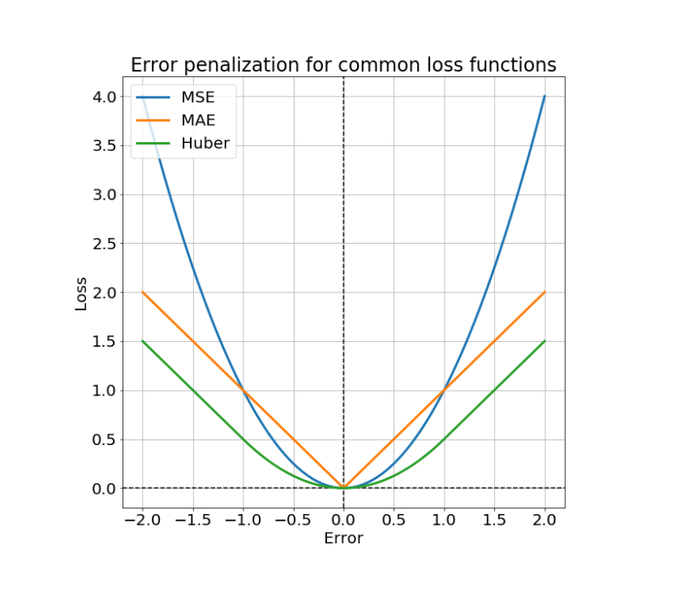
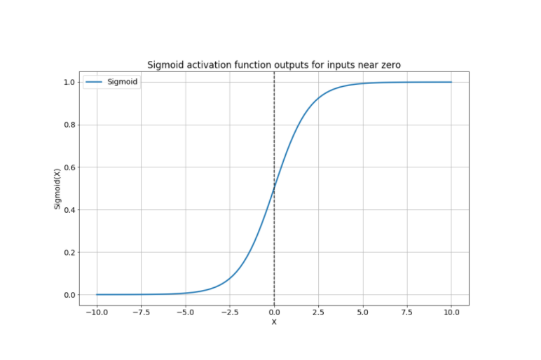
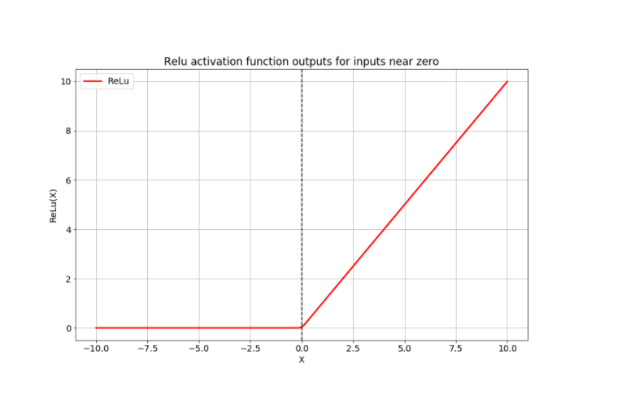

<script type="text/javascript" src="http://cdn.mathjax.org/mathjax/latest/MathJax.js?config=TeX-AMS-MML_HTMLorMML"></script>
<script type="text/x-mathjax-config"> MathJax.Hub.Config({ tex2jax: {inlineMath: [['$', '$']]}, messageStyle: "none" });</script>

# **Notes on Deep Learning in Python**

**Source**: DataCamp \
**Aggregator**: Trinh Tran To Bang (Rachel1809)

- [**Notes on Deep Learning in Python**](#notes-on-deep-learning-in-python)
  - [**1. Loss Function**](#1-loss-function)
    - [*MSE*](#mse)
    - [*MAE*](#mae)
    - [*Huber*](#huber)
  - [**2. Linear Regression Model**](#2-linear-regression-model)
    - [Code linear regression example](#code-linear-regression-example)
    - [Code to load data batch size](#code-to-load-data-batch-size)
    - [Code to train linear regression in batches](#code-to-train-linear-regression-in-batches)
  - [**3. Activation Function**](#3-activation-function)
    - [*Sigmoid activation function*](#sigmoid-activation-function)
    - [*Relu activation function*](#relu-activation-function)
    - [*Softmax activation function*](#softmax-activation-function)
  - [**Optimizer**](#optimizer)
    - [*Stochastic gradient descent (SGD) optimizer*](#stochastic-gradient-descent-sgd-optimizer)
    - [*RMS prop optimizer*](#rms-prop-optimizer)
    - [*Adam optimizer (adaptive momentum)*](#adam-optimizer-adaptive-momentum)
    - [Code example credit card default prediction problem](#code-example-credit-card-default-prediction-problem)
  - [**Random initializers**](#random-initializers)
    - [Code to initialize variables in Tensorflow](#code-to-initialize-variables-in-tensorflow)
  - [**Neural networks and overfitting**](#neural-networks-and-overfitting)
    - [*Applying dropout*](#applying-dropout)
    - [Implementing droupout in a network](#implementing-droupout-in-a-network)

<div style="page-break-after: always;"></div>

## **1. Loss Function**

<p align="center">
  
</p>

### *MSE*
  - Strongly penalizes outliers
  - High (gradient) sensitivity near minimum
### *MAE*
  - Scales linearly with size of error
  - Low sensitivity near minimum
### *Huber*
  - Similar to MSE near minimum
  - Similar to MAE away from minimum

$\implies$ For greater sensitivity near the minimum, you will want to use MSE or Huber loss

$\implies$ To minimize the impact of outliers, you will want to use MAE or Huber loss.

**Syntax**

```python
tf.keras.losses.mse(targets, predictions)
```


## **2. Linear Regression Model**
Example of house pricing, based on size:

$$price=intercept+size*slope+error$$

- Intercept: where the line intersects the vertical axis 

### Code linear regression example

```python
def linear_regression(params, feature1 = size_log, feature2 = bedrooms):
	return params[0] + feature1*params[1] + feature2*params[2]

# Define the loss function
def loss_function(params, targets = price_log, feature1 = size_log, feature2 = bedrooms):
	# Set the predicted values
	predictions = linear_regression(params, feature1, feature2)
  
	# Use the mean absolute error loss
	return keras.losses.mae(targets, predictions)

# Define the optimize operation
opt = keras.optimizers.Adam()

# Perform minimization and print trainable variables
for j in range(10):
	opt.minimize(lambda: loss_function(params), var_list=[params])
	print_results(params)

```

### Code to load data batch size

```python
import pandas as pd
import numpy as np

for batch in pd.read_csv(‘kc_housing.csv’, chunksize=100):
	price = np.array(batch[‘price’], np.float32)
	size = np.array(bath[‘size’], np.float32)

```

### Code to train linear regression in batches

```python
import tensorflow as tf
import pandas as pd
import numpy as np

intercept = tf.Variable(0.1, tf.float32)
slope = tf.Variable(0.1, tf.float32)

def linear_regression(intercept, slope, features):
	return intercept + features * slope

def loss_function(intercept, slope, targets, features):
	predictions = linear_regression(intercept, slope, features)
	return tf.keras.losses.mse(targets, predictions)

opt = tf.keras.optimizers.Adam()

for batch in pd.read_csv(‘kc_housing.csv’, chunksize=100):
	price_batch = np.array(batch[‘price’], np.float32)
	size_batch = np.array(batch[‘lot_size’], np.float32)
	opt.minimize(labda: loss_function(intercept, slope, price_batch, 				size_batch), var_list = [intercept, slope])

print(intercept.numpy(), slope.numpy())

```

- var_list: list of paremters to be updated


## **3. Activation Function**
Components of a typical hidden layer:

- **Linear**: matrix multiplication
- **Non-linear**: activation function is used to solve that
  
### *Sigmoid activation function*

<p align="center">
  
</p>

- pass the **sum of the product of weights and inputs** into 
`tf.keras.activations.sigmoid`
- Binary classification problems
- Low-level: 
  `tf.keras.activations.sigmoid()`
- High-level: sigmoid

### *Relu activation function*

<p align="center">
  
</p>

- Return x if x > 0; else return 0
- Hidden layers
- Low-level: 
  `tf.keras.activations.relu()`
- High-level: relu

### *Softmax activation function*
- return only 1 for the max value, used in classification problems
- Output layers (>2)
- Low-level
```python
tf.keras.activations.softmax()
```
- High-level: softmax

## **Optimizer**

### *Stochastic gradient descent (SGD) optimizer*
- `tf.keras.optimizers.SGD()`
- `learning rate`
- Main advatage: simple and easy to interpret

### *RMS prop optimizer*
- Two advantages over SGD: 
  - Applying different learning rates to each feature. Hence, it is the good choice for high dimensional problems.
  - Allows us to both build momentum and also allow it to decay. Setting a low value for the decay parameter will prevent momentum from accumulating over long periods during the training process. 
  
- Root Mean Squared (RMS) propagation optimizer
  - `tf.keras.optimizers.RMSprop()`
  - `learning_rate`
  - `momentum`

### *Adam optimizer (adaptive momentum)*
  - Generally the good first choice
  - Set the momentum to decay faster by lowering the `beta1` parameter
  - Perform well with default parameter values

### Code example credit card default prediction problem

Note: Assume that data has been already initialized

```python
import tensorflow as tf

def model(bias, weights, features = borrower_features):
  product = tf.matmul(features, weights)
  return tf.keras.activations.sigmoid(product+bias)

def loss_function(bias, weights, targets=default, features=borrower_features):
  predictions = model(bias, weights)
  return tf.keras.losses.binary_crossentropy(targets, predictions)

opt = tf.keras.optimizers.RMSprop(learning_rate = 0.01, momentum=0.9)
opt.minimize(lambda: loss_function(bias, weights), var_list=[bias, weights])
```

`binary_crossentropy`: the standard loss function for binary classification problems


## **Random initializers**
- Often need to initialize thousands of variables
  - tf.ones() may perform poorly
  - Tedious and difficult to initialize variables individually
- Alternatively, draw initial values from probability distribution 
  - Normal
  - Uniform
  - Glorot initializer (designed for ML algorithms)

### Code to initialize variables in Tensorflow

- Low-level approach
  
```python
import tensorflow as tf

#Define 500x500 random normal variable
weights = tf.Variable(tf.random.normal([500, 500]))

#Define 500x500 truncated random normal variable
weights = tf.Variable(tf.random.truncated_normal([500, 500]))
```

`truncated_normal`: discards very large and very small draws

- High-level approach
```python

#Define a dense layer with default initializer
dense = tf.keras.layers.Dense(32, activation='relu')

#Define a dense layer with the zeros initializer
dense = tf.keras.layers.Dense(32, activation='relu', \
    kernel_initializer='zeros')
```

## **Neural networks and overfitting**
### *Applying dropout*
- Randomly drop the weights connected to certain nodes in a layer during training process
- This will force your network to develop more robust rules for classification, since it cannot rely on any particular nodes being passed to an activation function
- This will tend to improve out-of-sample performance

### Implementing droupout in a network
```python
import numpy as np
import tensorflow as tf

inputs = np.array(borrower_features, np.float32)

dense1 = tf.keras.layers.Dense(32, activation='relu')(inputs)
dense2 = tf.keras.layers.Dense(16, activation='relu')(dense1)

dropout1 = tf.keras.layers.Dropout(0.25)(dense2)
output = tf.keras.layers.Dense(1, activation='sigmoid')(dropout1)
```

`tf.keras.layers.Dropout(0.25)(dense2)`: drop the weights connected to 25% of nodes randomly