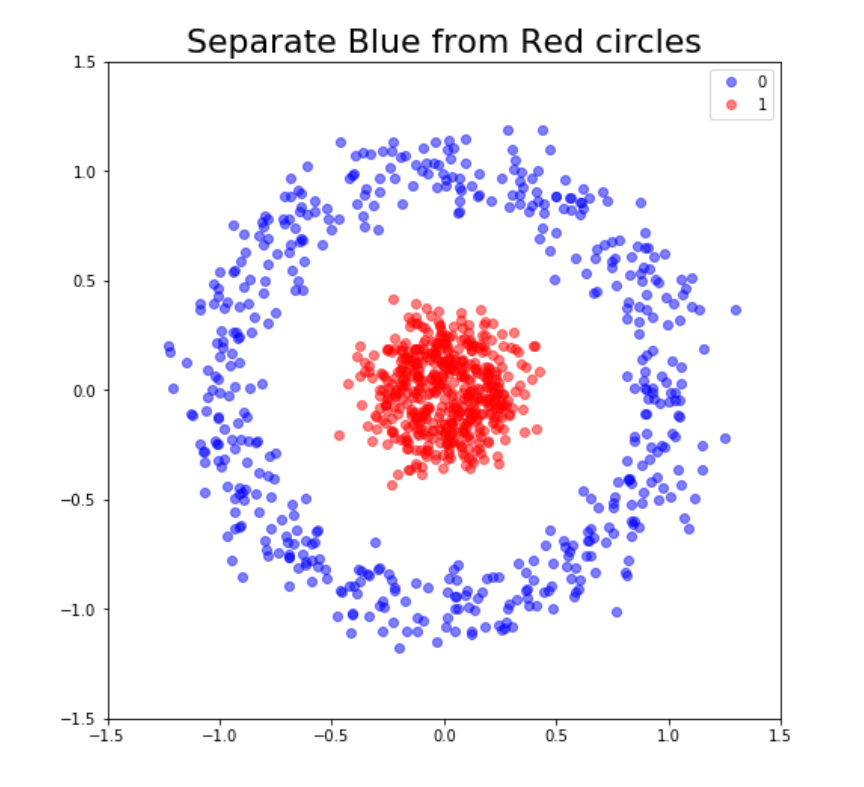
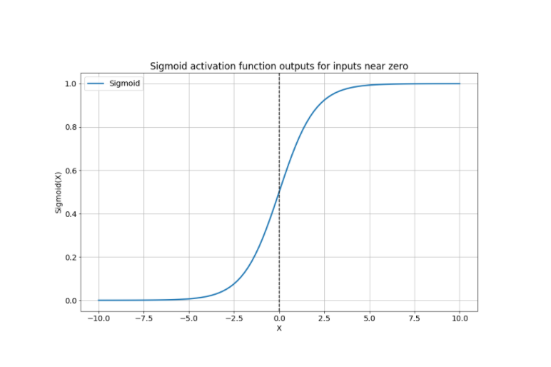

<script type="text/javascript" src="http://cdn.mathjax.org/mathjax/latest/MathJax.js?config=TeX-AMS-MML_HTMLorMML"></script>
<script type="text/x-mathjax-config"> MathJax.Hub.Config({ tex2jax: {inlineMath: [['$', '$']]}, messageStyle: "none" });</script>

# **Notes on Keras**

**Source**: DataCamp \
**Aggregator**: Trinh Tran To Bang (Rachel1809)

- [**Notes on Keras**](#notes-on-keras)
  - [**Steps building model**](#steps-building-model)
  - [**When using neural networks**](#when-using-neural-networks)
  - [**When using binary classification**](#when-using-binary-classification)
    - [*Pairplot*](#pairplot)
  - [**Callback**](#callback)
    - [*History*](#history)
    - [*Early stopping*](#early-stopping)
    - [*Model checkpoint*](#model-checkpoint)
  - [**Learning curve**](#learning-curve)
  - [**Activation functions**](#activation-functions)
    - [*Which activation to use*](#which-activation-to-use)
    - [*Comparing activation functions*](#comparing-activation-functions)
  - [**Batch size and batch normalization**](#batch-size-and-batch-normalization)
    - [*Mini-batches*](#mini-batches)
    - [*Standardization (a normalization approach)*](#standardization-a-normalization-approach)
      - [Batch normalization advantages](#batch-normalization-advantages)
      - [Code](#code)
  - [**Hyperparameter tuning**](#hyperparameter-tuning)
    - [*Neural network kyperparamters*](#neural-network-kyperparamters)
    - [*Sklearn recap*](#sklearn-recap)
    - [*Turn a keras model into sklearn estimator*](#turn-a-keras-model-into-sklearn-estimator)
    - [*Cross-validation*](#cross-validation)
    - [*Tips for neural networks hyperparameter tuning*](#tips-for-neural-networks-hyperparameter-tuning)
    - [*Random search on Keras*](#random-search-on-keras)
    - [*Tuning other hyperparameters*](#tuning-other-hyperparameters)
  - [**Tensors, layers and autoencoder**](#tensors-layers-and-autoencoder)
    - [*Accessing Keras layers*](#accessing-keras-layers)
    - [*What are tensors?*](#what-are-tensors)
    - [*Autoencoders*](#autoencoders)
      - [Autoencoder use cases](#autoencoder-use-cases)
      - [*Building a simple autoencoder*](#building-a-simple-autoencoder)
      - [*Breaking it into an encoder*](#breaking-it-into-an-encoder)
  - [**Convolutional Neural Networks (CNNs)**](#convolutional-neural-networks-cnns)
    - [*Build CNN in Keras*](#build-cnn-in-keras)
    - [*Pre-processing images for ResNet50*](#pre-processing-images-for-resnet50)
    - [*Using the ResNet50 model in Keras*](#using-the-resnet50-model-in-keras)
  - [**Long Short Term Memory networks (LSTMs)**](#long-short-term-memory-networks-lstms)
    - [*What is LSTMs*](#what-is-lstms)
    - [*When using LSTMs*](#when-using-lstms)
    - [*How to use LSTMs with text data to predict the next word in a sentence*](#how-to-use-lstms-with-text-data-to-predict-the-next-word-in-a-sentence)


<div style="page-break-after: always;"></div>

## **Steps building model**
1. model.add(Dense(), activation)
2. model.compile(optimizer, loss)
3. model.fit(features, labels, epochs)
4. model.evaluate(features, labels, verbose)

`verbose=0`: not see the process
`verbose=1`: see process like ========>
`verbose=2`: see process like 1/100


## **When using neural networks**
- Dealing with unstructured data
- Don't need easily interpretable results
- Benefit from a known architecture
- Example: classify images of cats and dogs
- Images -> Unstructured data
- Don't care about why the network knows it's a cat or a dog
- Benefit from CNN (convolutional neural networks)

## **When using binary classification**

<p align="center">
  
</p>

- Solve problem predicting whether an observation belongs to one of two possible classes
- A simple binary classification problem could be learning the boundaries to seperate blue from red circles as shown in the image

### *Pairplot*
```python
import seaborn as sns

#Plot a pairplot
sns.pairplot(circles, hue='target')
```

The `sigmoid` activation function squashes the neuron output to a floating point number between 0 and 1.
$$\sigma = \frac{1}{1 + e^{-z}}$$

<p align="center">
  
</p>

The `categorical_crossentropy` measures the difference between the predicted probabilities and the true label of the class we should have predicted.

```python
import pandas as pd
from keras.utils import to_categorical

df = pd.read_csv('data.csv')

#Turn response variable into labeled codes
df.response = pd.Categorical(df.response)
df.response = df.response.cat.codes

y = to_categorical(df.response)
```

The `binary_crossentropy`: when we perform several binary classification problems: for each output we are deciding whether or not its corresponding label is present.

```python
from keras.models import Sequential
from keras.layers import Dense

model = Sequential()

model.add(Dense(2, input_shape=(1,)))
model.add(Dense(3, activation='sigmoid))

model.compile(optimizer='adam', loss='binary_crossentropy')

model.fit(X_train, y_train, epochs=100, validation_split=0.2)
```

## **Callback**
A callback function that is executed after some other function, event or task has finished. 

### *History*
We can check the save metrics of the model at each epoch during training as an array of numbers.

```python
history = model.fit(X_train, y_train, epochs = 100, validation_data=[X_test, y_test] metrics=['accuracy'])

print(history.history['loss'])
```

### *Early stopping*
```python
from keras.callbacks import EarlyStopping

early_stopping = EarlyStopping(monitor ='val_loss', patience = 5)

model.fit(X_train, y_train, epochs = 100, validation_data = (X_test, y_test), callbacks=[early_stopping])

```

`patience`: number of epochs to wait or the model to improve beore stopping it's training

### *Model checkpoint*

Model checkpoint allow us to save model as it trains
```python
from keras.callbacks import ModelCheckpoint

model_save = ModelCheckpoint('best_model.hd5', save_best_only = True)

model.fit(X_train, y_train, epochs=100, validation_data=(X_test, y_test), callbacks=[model_save])

```


## **Learning curve**
Code a graph to visualize the process of training and test accuracy and loss
```python
init_weights = mode.get_weights()

train_accs = []
tests_accs = []

for train_size in train_sizes:
  #Split a fractin according to train_size
  X_train_frac, y_train_frac = 
  train_test_split(X_train, y_train, train_size=train_size)

  #Set model initial weights
  model.set_weights(initial_weights)

  model.fit(X_train_frac, y_train_frac, epochs=100, verbose=0, callbacks=[EarlyStopping(monitor='loss', patience=1)])

  train_acc = model.evaluate(X_train_frac, y_train_frac, verbose=0)[1]
  train_accs.append(train_acc)

  test_acc = model.evaluate(X_test, y_test, verbose=0)[1]
  test_accs.append(test_acc)
  print("Done with size: ", train_size)
```

Code to plot
```python
def plot_loss(loss,val_loss):
  plt.figure()
  plt.plot(loss)
  plt.plot(val_loss)
  plt.title('Model loss')
  plt.ylabel('Loss')
  plt.xlabel('Epoch')
  plt.legend(['Train', 'Test'], loc='upper right')
  plt.show()

h_callback = model.fit(X_train, y_train, epochs = 60, validation_data = (X_test, y_test), verbose=0)

# Extract from the h_callback object loss and val_loss to plot the learning curve
plot_loss(h_callback.history['loss'], h_callback.history['val_loss'])
```

## **Activation functions**
4 well-known activation functions are:
- sigmoid: varies between 0 and 1 for all possible X input values
- tanh: Hyperbolic tangent, similar to sigmoid in shape but varies from -1 to 1
- relu (rectified linear unit): varies from 0 to infinity
- leaky_relu: doesn't sit at 0, allowing negative values, for negative inputs
- softmax

### *Which activation to use*
- No magic formula
- Different properties
- Depends on our problem
- Goal to achieve in a given layer
- ReLU is a good first choice, since they train fast and tend to generalize well to most problems
- Sigmoids not recommend for deep models
- Tune with experimentation

### *Comparing activation functions*
```python
import pandas as pd

np.random.seed(1)

def get_model(act_function):
  model = Sequential()
  mode.add(Dense(4, input_shape = (2,), activation=act_function))
  return model

activations = ['relu', 'sigmoid', 'tanh']

activation_results = {}

for func in activations:
  model = get_mode(act_function=func)
  history = model.fit(X_train, y_train, validation_data=(X_test, y_test), epochs= 100, verbose=0)
  activation_results[func] = history

#Extract val_loss history of each activation function
val_loss_per_func = {k:v.history['val_loss'] for k, v in activation_results.items()}

#Turn the dictionary into a pandas dataframe
val_loss_curves = pd.DataFrame(val_loss_per_funct)

#Plot the curves
val_loss.curves.plot(title='Loss per Activation function')
```

## **Batch size and batch normalization**

### *Mini-batches*
* Advantages
  - Networks train faster (more weight updates in same amount of time)
  - Less RAM memory required, can train on huge datasets
  - Noise can help networks reach a lower error, escaping local minima

* Disadvantages
  - More iterations to be run
  - Need to be adjusted, we need to find a good batch size
  
### *Standardization (a normalization approach)*

Batch normalization make sure that, independently of the changes, the inputs to the next layers are normalized

#### Batch normalization advantages
- Improves gradient flow
- Allows higher learning rate
- Reduces dependence on weight initializations
- Acts as an uninteded form of regularization
- Limits internal covariate shift

#### Code
```python
from keras.layers import BatchNormalization

model = Sequential()

model.add(Dense(3, input_shape=(2,), activation='relu'))
model.add(BatchNormalization())
model.add(Dense(1, activation='sigmoid'))
```

Batch normalization effects
- Batch normalization tends to increase the learning speed of our models and make their learning curves more stable. 


## **Hyperparameter tuning**
### *Neural network kyperparamters*
- Number of layers
- Number of neurons per layer
- Layer order
- Layer activations
- Batch size
- Learning rates
- Optimizers
- ...

### *Sklearn recap*
We can perform hyperparameter search by using methods like RandomizedSearchCV

```python
from skearn.model_selection import RandomizeSearchCV

tree = DecisionTreeClassifier()

#Define a series of parameters to look over
params = {'max_depth':[3, None], "max_features": range(1, 4), 'min_samples_leaf': range(1, 4)}

#Perform random search with cross validation
tree_cv = RandomizedSearchCV(tree, params, cv=5)
tree_cv.fit(X,y)

print(tree_cv.best_params_)
```

`cv`: number of cross-validation folds

### *Turn a keras model into sklearn estimator*
```python
def create_model(optimizer='adam', activation='relu'):
  model = Sequential()
  model.add(Dense(16, input_shape=(2,), activation=activation))
  model.add(Dense(1, activation='sigmoid'))
  model.compile(optimizer=optimizer, loss='binary_crossentropy')
  return model

from keras.wrappers.scikit_learn import KerasClassifier

#Create model as sklearn estimator
model = KerasClassifier(build_fn=create_model, epochs=6, batch_size=16)
```

### *Cross-validation*
```python
from sklearn.model_selection import cross_val_score

#Check how your keras model performs with 5 fold crossvalidation
kfold = cross_val_score(model, X, y, cv=5)

kfold.mean()

#Print the standard deviation per fold
kfold.std()
```

### *Tips for neural networks hyperparameter tuning*
- Using random search
- Don't use many epochs
- Use a smaller sample of your dataset
- Play with batch sizes, activations, optimizers and learning rates

### *Random search on Keras*
```python
#Define series of parameters
params = dict(optimizer=['sgd', 'adam'], epochs=3, batch_size=[5, 10, 20], activation=['relu', 'tanh'])

#Create a random search cv object and fit it to the data
random_search = RandomizedSearchCV(model, params_dist=params, cv=3)
random_seach_results = random_search.fit(X, y)

print("Best: %f using %s".format(random_search_results.best_score_), random_search_results.best_params_)
```

### *Tuning other hyperparameters*
```python
def create_model(nl=1, nn=256):
  model = Sequential()
  model.add(Dense(16, input_shape=(2,), activation='relu'))
  for i in range (nl):
    model.add(Dense(nn, activation='relu'))

params = dict(nl=[1, 2, 9], nn=[128, 256, 1000])
```

`nl`: number of hidden layers
`nn`: number of neurons per layer

## **Tensors, layers and autoencoder**
### *Accessing Keras layers*
```python
#Accessing the first layer of a Keras model
first_layer = model.layers[0]

#Printing the layer, its input, output and weights
print(first_layer.input)
print(first_layer.output)
print(first_layer.weights)
```

### *What are tensors?*
Tensors are the main data structures used in deep learning, inputs, outputs and transformations in neural networks are all represented using tensors.

A tensor is multi-dimensional array of numbers

```python
import keras.backend as K

inp = model.layers[0].input
out = model.layers[0].output

#Function that maps layer inputs to outputs
inp_to_out = K.function([inp], [out])

print(inp_to_out([X_train]))
```

### *Autoencoders*
Autoencoders are models that aim at producing the same inputs as outputs. This task alone wouldn't be very useful, but since along the way we decrease the number of neurons, we are effectively make our network learn to compress its inputs into a small set of neurons.

#### Autoencoder use cases
- Dimensionality reduction:
  - Smaller dimensional space representation of our inputs
- De-noising data:
  - If trained with clean data, irrelevant noise will be filtered out during reconstruction.
- Anomaly detection
  - A poor reconstruction will result when the model is fed with unseen inputs.
- ...

#### *Building a simple autoencoder*
Autoencoders have several interesting applications like anomaly detection or image denoising. They aim at producing an output identical to its inputs. The input will be compressed into a lower dimensional space, `encoded`. The model then learns to `decode` it back to its original form.
```python
autoencoder = Sequential()

autoencoder.add(Dense(4, input_shape=(100,), activation='relu'))
autoencoder.add(Dense(100, activation='sigmoid'))
autoencoder.compile(optimizer='adam', loss='binary_crossentropy')
```

#### *Breaking it into an encoder*
```python
encoder = Sequential()
encoder.add(autoencoder.layers[0])
encoder.predict(X_test)
```

## **Convolutional Neural Networks (CNNs)**
A convolutional model uses convolutional layers. A convolution is a simple mathematical operation that preserves spatial relationships.

It consists of applying a filter also known as kernel of a given size. We center the kernel matrix of numbers as we slide through each pixel in the image, multiplying the kernel and pixel values at each location and averaging the sum of values obtained.

This effectively computes a new image where certain characteristics are amplified depending on the filter used. The secret sauce of CNNs resides in letting the network itself find the best filter values and to combine them to achieve a given task.

### *Build CNN in Keras*
```python
from keras.layers import Dense, Conv2D, Flatten

model = Sequential()

#Add a convolutional layer with 32 filters of size 3x3
model.add(Conv2D(filters=32, kernel_size=3, input_shape=(28, 28, 1), activation='relu'))

#Add another convolutional layer
model.add(Conv2D(8, kernel_size=3, activation='relu')

#Flatten the output of the previous layer
model.add(Flatten())

model.add(Dense(3, activation='softmax'))
```

`filters`: number of different convolutional masks

### *Pre-processing images for ResNet50*
```python
#Import image from keras preprocessing
from keras.preprocessing import image

#Import preprocess_input from keras applications resnet50
from keras.applications.resnet50 import preprocess_input

img = image.load_img(img_path, target_size=(224, 224))

#Turn it into an array
img = image.img_to_array(img)

#Expand the dimensions so that it's understood by our network
#img.shaoe turns from (224, 224, 3) into (1, 224, 224, 3)
img = np.expand_dims(img, axis=0)

#Pre-process the img in the same way training images
img = preprocess_input(img)
```

### *Using the ResNet50 model in Keras*
```python
from keras.applications.resnet50 import ResNet50, decode_predictions

model = ResNet50(weights='imagenet')
preds = model.predict(img)
print("Predicted:", decode_predictions(preds, top=1)[0])
```

## **Long Short Term Memory networks (LSTMs)**

### *What is LSTMs*

LSTMs are a type of recurrent neural network (RNNs)
A simple RNN is a neural network that can use past predictions in order to infer new ones.
This allows us to solve problems where there is a dependence on past inputs.

LSTM neurons are pretty complex, they are actually called units or cells. They have an internal state that is passed between units. A unit receives the internal state, an output from the previous unit, and a new input at time t. Then it updates the state and produces a new output that is returned, as well as passed as an input to the following unit.

LSTM units perform several operations. They learn what to ignore, what to keep and to select the most important pieces of past information in order to predict the future. They tend to work better than simple RNNs for most problems.

### *When using LSTMs*
- Image captioning
- Speech to text
- Text translation
- Document summarization
- Text generation

### *How to use LSTMs with text data to predict the next word in a sentence*
```python
text = 'Hi this is a small sentence'
seq_len = 3
words = text.split()
```

`seq_len=3`: end up feeding model with 2 words and predict the third one.

```python
lines = []
for i in range(seq_len, len(words) + 1):
  line = ' '.join(wor ds[i-seq_len:i])
  lines.append(line)
```

```python
from keras.preprocessing.text import Tokenizer
tokenizer = Tokenizer()
#Fit it on the previous lines
tokenizer.fit_on_texts(lines)
#Turn the lines into numeric sequences
sequences = tokenizer.texts_to_sequences(lines)

print(tokenizer.index_word)
```

Now build LSTM model
```python
from keras.layers import Dense, LSTM, Embedding
model = Sequential()
vocab_size = len(tokenizer.index_word) + 1
model.add(Embedding(input_dim=vocab_size, output_dim=8, input_length=2))
model.add(LSTM(8))

model.add(Dense(8, activation='relu'))
mode.add(Dense(vocab_size, activation='softmax'))
```


