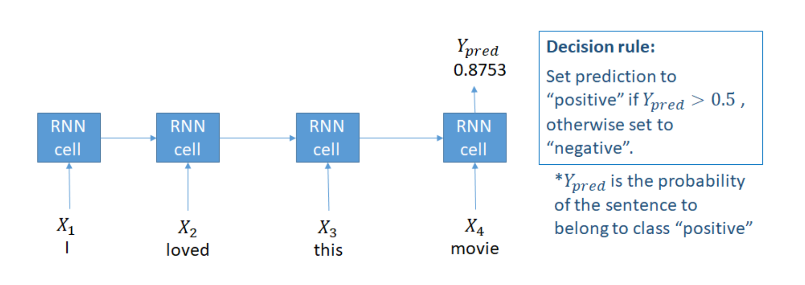
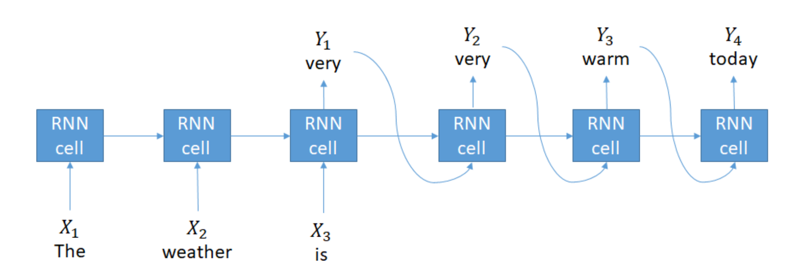
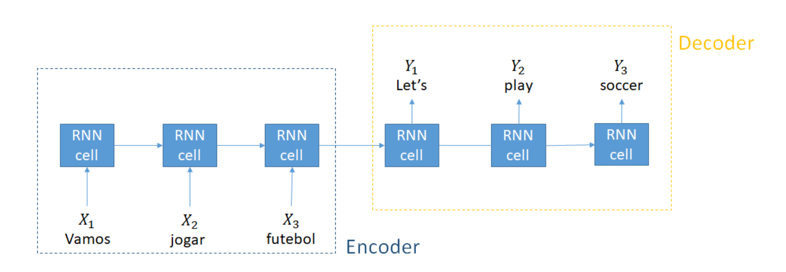
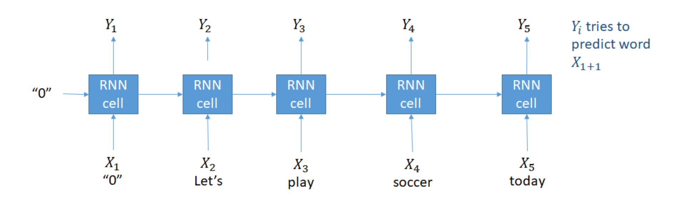
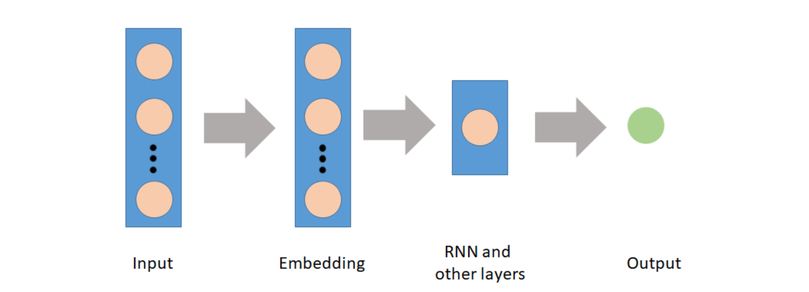
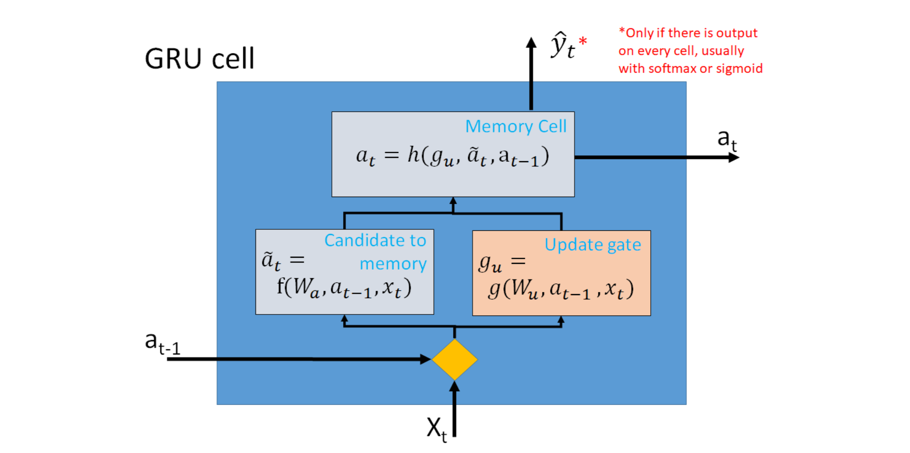
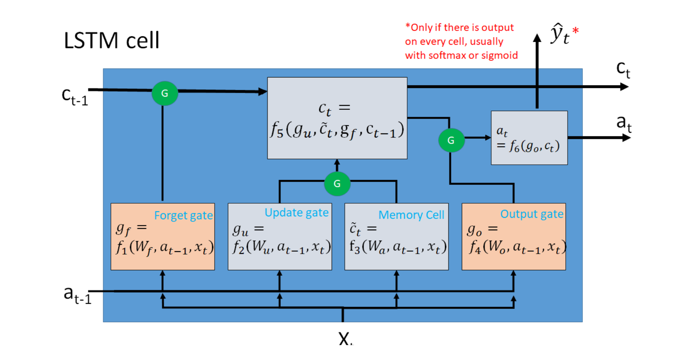

<script type="text/javascript" src="http://cdn.mathjax.org/mathjax/latest/MathJax.js?config=TeX-AMS-MML_HTMLorMML"></script>
<script type="text/x-mathjax-config"> MathJax.Hub.Config({ tex2jax: {inlineMath: [['$', '$']]}, messageStyle: "none" });</script>

# **Recurrent Neural Networks for Language Modeling in Python**

**Source**: DataCamp \
**Aggregator**: Trinh Tran To Bang (Rachel1809)

- [**Recurrent Neural Networks for Language Modeling in Python**](#recurrent-neural-networks-for-language-modeling-in-python)
  - [**Application of machine learning to text data**](#application-of-machine-learning-to-text-data)
  - [**Advantage of Recurrent Neural Networks (RNN)**](#advantage-of-recurrent-neural-networks-rnn)
  - [**Sequence to Sequence models**](#sequence-to-sequence-models)
    - [1. *Many to one: classification*](#1-many-to-one-classification)
    - [2. *Many to many: text generation*](#2-many-to-many-text-generation)
    - [3. *Many to many: neural machine translation*](#3-many-to-many-neural-machine-translation)
    - [4. *Many to many: language model*](#4-many-to-many-language-model)
  - [**Language models**](#language-models)
    - [<u>*Sentence probability*</u>](#usentence-probabilityu)
    - [<u>*Link to RNNs*</u>](#ulink-to-rnnsu)
    - [<u>*Building vocabulary dictionaries*</u>](#ubuilding-vocabulary-dictionariesu)
      - [*Code to build vocabulary dictionaries*](#code-to-build-vocabulary-dictionaries)
    - [<u>*Preprocessing input*</u>](#upreprocessing-inputu)
      - [*Code to preprocess input*](#code-to-preprocess-input)
    - [<u>*Transforming new texts*</u>](#utransforming-new-textsu)
      - [*Code to transform new texts*](#code-to-transform-new-texts)
  - [**RNNs inside Keras**](#rnns-inside-keras)
    - [<u>*keras.models*</u>](#ukerasmodelsu)
    - [<u>*keras.layers*</u>](#ukeraslayersu)
    - [<u>*keras.preprocessing*</u>](#ukeraspreprocessingu)
    - [<u>*keras.datasets*</u>](#ukerasdatasetsu)
    - [*Many useful datasets*](#many-useful-datasets)
    - [<u>*Creating a model*</u>](#ucreating-a-modelu)
    - [<u>*Training the model*</u>](#utraining-the-modelu)
    - [<u>*Model evaluation and usage*</u>](#umodel-evaluation-and-usageu)
      - [*Evaluation*](#evaluation)
      - [*Prediction*](#prediction)
    - [<u>*Full example: IMDB Sentiment Classification*</u>](#ufull-example-imdb-sentiment-classificationu)
  - [**Vanishing and exploding gradients**](#vanishing-and-exploding-gradients)
    - [<u>*Forward propagation*</u>](#uforward-propagationu)
    - [<u>*Backward propagation through time*</u>](#ubackward-propagation-through-timeu)
    - [<u>*Back propagation through time continuation*</u>](#uback-propagation-through-time-continuationu)
    - [<u>*Solution to the gradient problems*</u>](#usolution-to-the-gradient-problemsu)
  - [**GRU and LSTM**](#gru-and-lstm)
    - [<u>*GRU*</u>](#ugruu)
    - [<u>*LSTM cell*</u>](#ulstm-cellu)
    - [<u>*No more vanishing gradients*</u>](#uno-more-vanishing-gradientsu)
    - [<u>*Usage in Keras*</u>](#uusage-in-kerasu)
  - [**The Embedding layer**](#the-embedding-layer)
    - [<u>*Why embeddings*</u>](#uwhy-embeddingsu)
    - [<u>*How to use in Keras*</u>](#uhow-to-use-in-kerasu)
    - [<u>*Transfer learning*</u>](#utransfer-learningu)
    - [<u>*Using GloVE pre-trained vectors*</u>](#uusing-glove-pre-trained-vectorsu)
    - [<u>*Using GloVE on a specific task*</u>](#uusing-glove-on-a-specific-tasku)
  - [**Sentiment classification revisited**](#sentiment-classification-revisited)

<div style="page-break-after: always;"></div>

## **Application of machine learning to text data**
- *Sentiment analysis*: classify message to be positive or negative
- *Multi-class classification*: categorize data into pre-defined category
- *Text generation*: automatically generate text or automatically reply to messages
- *Machine neural translation*: translate from one language to another

## **Advantage of Recurrent Neural Networks (RNN)**
The main advantage of RNN for text data is that it reduces the number of parameters of the model (avoiding one-hot encoding) and shares weight between different positions of the text.

## **Sequence to Sequence models**
### 1. *Many to one: classification*
Final output is probability distribution.

<p align="center">
  
</p>

### 2. *Many to many: text generation*
Using the previous prediction as input to next prediction.

<p align="center">
  
</p>

### 3. *Many to many: neural machine translation*
Divided into 2 blocks:
- `Encoder`: learn characteristics of the input language (no prediction)
- `Decoder`: learns for the output language (not receive inputs)

<p align="center">
  
</p>

### 4. *Many to many: language model*
Beginning with an artificial no input, then for every input word $i$, the model tries to predict the next word $i+1$ 

<p align="center">
  
</p>

## **Language models**

### <u>*Sentence probability*</u>
- Languge models represent the probability of a sentence.
  
  - For example: "I loved this movie."
  
- Unigram models use the probability of each word inside the document and assume the probabilities are independent.
  
  $$P(sentence) = P(I)P(loved)P(this)P(movie)$$

- N-gram: use the probability of each word conditional to the previous $N-1$ words
  - N = 2 (bigram):
  $$P(sentence) = P(i)P(loved|I)P(this|loved)P(movie|this)$$

  - N = 3 (trigram):
  $$P(sentence) = P(I)P(loved|I)P(this|I\text{ }loved)P(movie|loved\text{ }this)$$

- Skip gram: computes the probability of the context words, or neighboring words, given the center word.
  $$P(sentence = P(context \text{ } of \text{ } I|I) P(context \text{ } of \text{ } loved|loved) P(context \text{ } of \text{ } this|this)P(context \text{ } of \text{ } movie|movie)$$

- Neural networks
  - The probability of the sentence is given by a softmax function on the output layer of the network with unit is the size of vocabulary are also language models.

### <u>*Link to RNNs*</u>
- Language models are everywhere in RNNs
- RNNs models are themselves language models when trained on text data, since they give the probability of the next token given the previous k tokens.
- Embedding layer
It can be used to create vector representations of the tokens as the first layer
<p align="center">
  
</p>
  
### <u>*Building vocabulary dictionaries*</u>
When creating RNNs models, we need to transform text data into a sequence of numbers, which are indexes of the tokens in the array of unique tokens, the vocabulary.

#### *Code to build vocabulary dictionaries*
```python
#Get unique words
unique_words = list(set(text.split(' ')))

# Create dictionary: word is key, index is value
word_to_index = {k:v for (v, k) in enumerate(unique_words)}

#Create dictionary: index is key, word is value
index_to_word = {k:v for (k, v) in enumerate(unique_words)}
```

### <u>*Preprocessing input*</u>
With the created dictionary, we can prepare pairs of X and y to be used on a supervised machine learning model.

#### *Code to preprocess input*
```python
X = []
y = []

#Loop over the text: length `sentence_size` per time with step equal to `step`
for i in range (0, len(text) - sequence_size, step):
  X.append(text[i:i+sentence_size])
  y.append(text[i+sentence_size])  
```

```
# Example (numbers are numerical indexes of vocabulary): step = 2
# Sentence is: "I loved this movie" -> (["I", "loved", "this"], "movie")
X[0], y[0] = ([10, 444, 11], 17)
```

### <u>*Transforming new texts*</u>
When preparing new data, we can use the dictionary to get the correct indexes for each word.

#### *Code to transform new texts*
```python
#Create list to keep sentences of indexes
new_text_split = []

#Loop and get the indexes from dictionary
for sentence in new_text:
  sent_split = []
  for wd in sentence.split(' '):
    ix = wd_to_index[wd]
    sent_split.append(ix)
  new_text_split.append(sent_split)
```

## **RNNs inside Keras**
### <u>*keras.models*</u>
- `keras.models.Sequential`
- `keras.models.Model`

### <u>*keras.layers*</u>
- `LSTM`
- `GRU`
- `Dense`
- `Dropout`
- `Embedding`
- `Bidirectional`

### <u>*keras.preprocessing*</u>
It contains function for pre-processing data such as: `pad_sequences` method that transforms text data into fixed-length vectors.

```python
# Import relevant classes/functions
from keras.preprocessing.text import Tokenizer
from keras.preprocessing.sequence import pad_sequences

# Build the dictionary of indexes
tokenizer = Tokenizer()
tokenizer.fit_on_texts(texts)

# Change texts into sequence of indexes
texts_numeric = tokenizer.texts_to_sequences(texts)
print("Number of words in the sample texts: ({0}, {1})".format(len(texts_numeric[0]), len(texts_numeric[1])))

# Pad the sequences
texts_pad = pad_sequences(texts_numeric, 60)
print("Now the texts have fixed length: 60. Let's see the first one: \n{0}".format(texts_pad[0]))
```

### <u>*keras.datasets*</u>

### *Many useful datasets*
- IMDB Movie reviews
- Reuters newswire
- ...

### <u>*Creating a model*</u>
```python
from keras.models import Sequential
from keras.layers import Dense

model = Sequential()

model.add(Dense(64, activation='relu', input_dim=100))
model.add(Dense(1, activation='sigmoid'))

model.compile(optimzer='adam', loss='mean_squared_error', metrics=['accuracy'])
```

`input_dim`: instead of  `input_shape = (100, )`, it is `input_dim=100`

### <u>*Training the model*</u>
```python
model.fit(X_train, y_train, epochs=10, batch_size=32)
```

### <u>*Model evaluation and usage*</u>
#### *Evaluation*
```python
model.evaluate(X_test, y_test)
```

#### *Prediction*
```python
model.predict(new_data)
```

### <u>*Full example: IMDB Sentiment Classification*</u>
```python
model = Sequential()
model.add(Embedding(10000, 128))
model.add(LSTM(128, dropout=0.2))
model.add(Dense(1, activation='sigmoid'))

model.compile(loss='binary_crossentropy', optimizer='adam', metrics=['accuracy'])

model.fit(X_train, y_train, epochs=5)

score, acc = model.evaluate(X_test, y_test)
```

## **Vanishing and exploding gradients**
<p align="center">
  
</p>

### <u>*Forward propagation*</u>

<p align="center">
  
</p>

In forward propagation phase, we compute a hidden state $a$ that will carry past information by applying the linear combination over the previous step and the current input.

The ouput $y$ is computed only in the last hidden state often by applying a sigmoid or softmax activation function.

The loss function can be the `crossentropy` function and we use it to have a numeric value of the error.

### <u>*Backward propagation through time*</u>
<p align="center">
  
</p>

In the back propagation phase, we have to compute the **derivative** of the loss function with respect to the parameters. To compute the derivative of the loss with respect to the matrix $W_{a}$, we need to use the chain rule because $\hat{y}$ depends on $a_{T}$, which also depends on $W_{a}$

Remember that $a_{T}$ also depends on $a_{T-1}$ that depends on $W_{a}$ and so on:
$$a_{T} = f(W_{a}, a_{T-1}, x_{T})$$

Thus, we need to consider the contribution of every previous step by summing up their derivatives with respect to the matrix $W_{a}$. Also, the derivative of $a_{T}$ with respect to $W_{a}$ also need the chain rule of derivatives can be written as *the product of the intermediate states multiplied by the derivative of the first state with respect to the matrix*.

### <u>*Back propagation through time continuation*</u>
Computing derivatives leads to 
$$\frac{\partial a_{t}}{\partial W_{a}} = (W_{a})^{t-1}g(X)$$

- If value of the matrix < 1, $(W_{a})^{t-1}$ can converge to 0
- If value of the matrix > 1, it will diverge to $+\infty$

### <u>*Solution to the gradient problems*</u>
Some solutions are known:
- *Exploding gradients*
  - Gradient clipping/scaling: limiting the size of the gradients or scaling them can easily help us avoid the exploding gradient.
- *Vanishing gradients*
  - Better initialize the matrix W: intializing the matrix $W$ as an orthogonal matrix makes their multiplication always be equal to one.
  - Use regularization: controls the size of entries
  - Using ReLU activation function instead of tanh/sigmoid/softmax: the derivative becomes a const and thus doesn't increase or decrease exponentially.
  - **Use LSTM or GRU cells**

## **GRU and LSTM**
### <u>*GRU*</u>
<p align="center">
  
</p>

Before updating the memory cell, we first compute a **candidate** $\tilde{a}$ that will carry the present information. Then we compute the **update gate** $g_{u}$ that will determine if the candidate $\tilde{a}$ will be used as **memory** state of if we keep the past memory state $a-1$.

If the gate is zero, the network keeps the previous hidden state, and if it is equal to one, it uses the new value of $\tilde{a}$. 

Other values will be a combination of the previous and the candiate memory state, but during training it tends to get close to 0 or 1.

### <u>*LSTM cell*</u>
<p align="center">
  
</p>

The **forget gate** $g_{f}$ determines if the previous state $c_{t-1}$ state should be forgotten (set its value to 0) or not. The **update gate** $g_{u}$ do the same for the candidate hidden state $\tilde{c}$. The **output gate** $g_{o}$ do the same for the new hidden state $c_{t}$. 

The green circles on the picture represents the gates. We can think of them as an open or closed gate, allowing for the left side to pass through or not if the gates value are 0 or 1 respectively.

### <u>*No more vanishing gradients*</u>
- The `simpleRNN` cell can have gradient problems.
  - The weight matrix power t multiplies the other terms
- `GRU` and `LSTM` cells don't have vanishing gradient problems
  - Because of their gates
  - Don't have the weight matrices terms multiplying the rest
  - Exploding gradient problems are easier to solve

Gradient are no longer depends only on the memory cell state. The derivative of the loss function with respect to the weights matrix depends on all the gates and all the memory cell, summing each of its parts. This architecture adds different gradients (corresponding to the gradients of each gate and the memory state) making the total gradient stop converging to zero or diverging.

If the gradient is exponentially increasing or decreasing, we expect the training phase to adjust the value of the corresponding gate accordingly to stop this vanishing or exploding tendency.

### <u>*Usage in Keras*</u>
```python
from keras.layers import GRU, LSTM

model.add(GRU(units=128, return_sequences=True, name='GRU layer'))
model.add((LSTM(units=64, return_sequences=False, name='LSTM layer')))
```

`return_seuquences`: used when adding more than one layer in sequence, making all the cells to emit an output that will be fed to the next layer as input.

## **The Embedding layer**

### <u>*Why embeddings*</u>
- Advantages:
  - Reduce the dimension: because the one-hot encoding of the tokens in a scenario with a very big vocabulary (maybe 100 thousand words) demands a lot of memory. An embedding layer with dimnension is more viable.
  ```python
   one_hot = np.array((N, 100000))
   embedd = np.array((N, 300))
  ```
  - Dense representation: the implementations gives surprisingly nice understanding of the tokens.
  - Transfer learning

- Disadvantages:
  - Lots of parameters to train: training takes longer

### <u>*How to use in Keras*</u>
The `Embedding` layer should be the first layer of the model.
```python
from keras.layers import Embedding

model.add(Embedding(input_dim=100000, output_dim=300, trainable=True, embeddings_initializer=None, input_length=120))

```

`input_dim`: size of vocabulary
`output_dim`: dimension of the embedding space 
`trainable`: defines if this layer should have its weights updated or not during the training phase.
`embeddings_initializer`: used to perform transfer learning by using pre-trained weights for the words in your vocabulary.

Note: often, when using *transfer learning*, we set *trainable* to be `False`, but not compulsory.

`input_length`: determines the size of the sequences (it assumes that you padded the input sentences beforehand).

### <u>*Transfer learning*</u>
Transfer learning for language models:
- GloVE
- word2vec
- BERT

In Keras, we need the constant initializer to define the pre-traine matrix of the Embedding layer:
```python
from keras.initializers import Constant

model.add(Embedding(input_dim=vocabulary_size, output_sim=embedding_dim, embeddings_initializer=Constant(pre_trained_vectors)))
```

### <u>*Using GloVE pre-trained vectors*</u>
Official site: https://nlp.stanford.edu/projects/glove/

GloVE files contain rows seperated by spaces, where the first column is the word and the others are the weights values for each dimension of the embedding space.

```python
#Get hte GloVE vectors
def get_glove_vectors(filename='glove.6B.300d.txt'):
  #Get all word vectors from pre-trained model
  glove_vector_dict={}
  with open(filename) as f:
    for line in f:
      values = line.split()
      word = values[0]
      coefs = values[1:]
      glove_vector_dict[word] = np.asarray(coefs, dtype='float32')

```

### <u>*Using GloVE on a specific task*</u>
```python
#Filter GloVE vectors to specific task
def filter_glove(vocabulary_dict, glove_dict, wordvec_dim=300):
  # Create a matrix with shape equal number of words + 1 (zero for padding tokens) and embedding space dim to store the vectors
  embedding_matrix = np.zeros((len(vocabulary_dict) + 1, wordvec_dim))
  for word, i in vocabulary_dict.items():
    embedding_vector = glove_dict.get(word)
    if embedding_vector is not None:
      # words not found in the glove_dict will be all-zeros
      embedding_matrix[i] = embedding_vector

  return embedding_matrix
```

## **Sentiment classification revisited**

