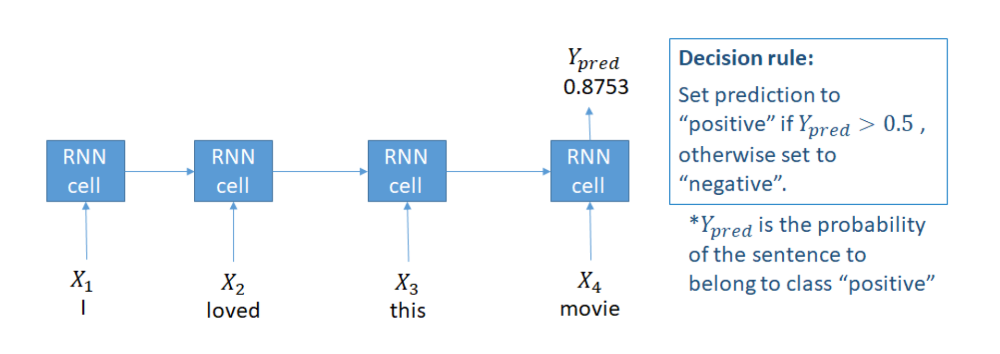
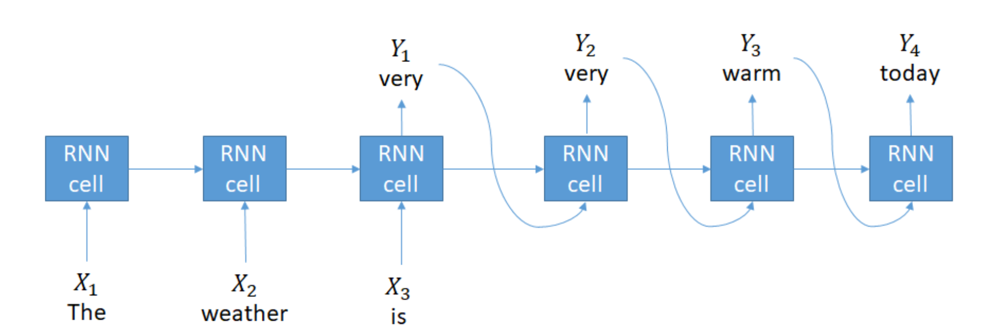
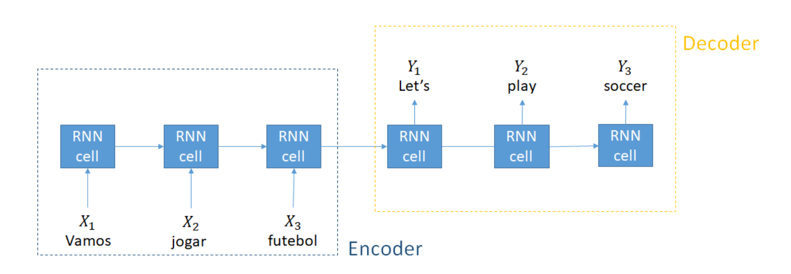
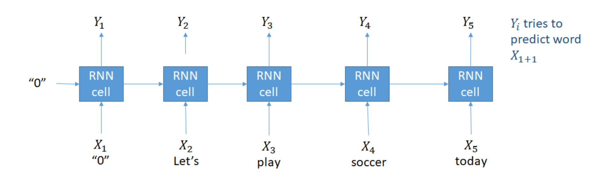
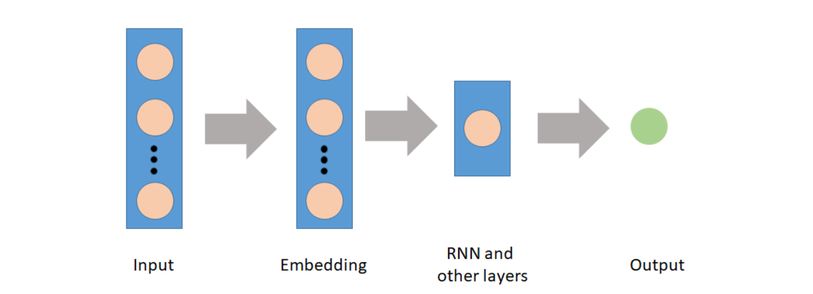

<script type="text/javascript" src="http://cdn.mathjax.org/mathjax/latest/MathJax.js?config=TeX-AMS-MML_HTMLorMML"></script>
<script type="text/x-mathjax-config"> MathJax.Hub.Config({ tex2jax: {inlineMath: [['$', '$']]}, messageStyle: "none" });</script>

# **Recurrent Neural Networks for Language Modeling in Python**

**Source**: DataCamp \
**Aggregator**: Trinh Tran To Bang (Rachel1809)

- [**Recurrent Neural Networks for Language Modeling in Python**](#recurrent-neural-networks-for-language-modeling-in-python)
  - [**Application of machine learning to text data**](#application-of-machine-learning-to-text-data)
  - [**Advantage of Recurrent Neural Networks (RNN)**](#advantage-of-recurrent-neural-networks-rnn)
  - [**Sequence to Sequence models**](#sequence-to-sequence-models)
    - [1. *Many to one: classification*](#1-many-to-one-classification)
    - [2. *Many to many: text generation*](#2-many-to-many-text-generation)
    - [3. *Many to many: neural machine translation*](#3-many-to-many-neural-machine-translation)
    - [4. *Many to many: language model*](#4-many-to-many-language-model)
  - [**Language models**](#language-models)
    - [<u>*Sentence probability*</u>](#usentence-probabilityu)
    - [<u>*Link to RNNs*</u>](#ulink-to-rnnsu)
    - [<u>*Building vocabulary dictionaries*</u>](#ubuilding-vocabulary-dictionariesu)
      - [*Code to build vocabulary dictionaries*](#code-to-build-vocabulary-dictionaries)
    - [<u>*Preprocessing input*</u>](#upreprocessing-inputu)
      - [*Code to preprocess input*](#code-to-preprocess-input)
    - [<u>*Transforming new texts*</u>](#utransforming-new-textsu)
      - [*Code to transform new texts*](#code-to-transform-new-texts)

<div style="page-break-after: always;"></div>

## **Application of machine learning to text data**
- *Sentiment analysis*: classify message to be positive or negative
- *Multi-class classification*: categorize data into pre-defined category
- *Text generation*: automatically generate text or automatically reply to messages
- *Machine neural translation*: translate from one language to another

## **Advantage of Recurrent Neural Networks (RNN)**
The main advantage of RNN for text data is that it reduces the number of parameters of the model (avoiding one-hot encoding) and shares weight between different positions of the text.

## **Sequence to Sequence models**
### 1. *Many to one: classification*
Final output is probability distribution.

<p align="center">
  
</p>

### 2. *Many to many: text generation*
Using the previous prediction as input to next prediction.

<p align="center">
  
</p>

### 3. *Many to many: neural machine translation*
Divided into 2 blocks:
- `Encoder`: learn characteristics of the input language (no prediction)
- `Decoder`: learns for the output language (not receive inputs)

<p align="center">
  
</p>

### 4. *Many to many: language model*
Beginning with an artificial no input, then for every input word $i$, the model tries to predict the next word $i+1$ 

<p align="center">
  
</p>

## **Language models**

### <u>*Sentence probability*</u>
- Languge models represent the probability of a sentence.
  
  - For example: "I loved this movie."
  
- Unigram models use the probability of each word inside the document and assume the probabilities are independent.
  
  $$P(sentence) = P(I)P(loved)P(this)P(movie)$$

- N-gram: use the probability of each word conditional to the previous $N-1$ words
  - N = 2 (bigram):
  $$P(sentence) = P(i)P(loved|I)P(this|loved)P(movie|this)$$

  - N = 3 (trigram):
  $$P(sentence) = P(I)P(loved|I)P(this|I\text{ }loved)P(movie|loved\text{ }this)$$

- Skip gram: computes the probability of the context words, or neighboring words, given the center word.
  $$P(sentence = P(context \text{ } of \text{ } I|I) P(context \text{ } of \text{ } loved|loved) P(context \text{ } of \text{ } this|this)P(context \text{ } of \text{ } movie|movie)$$

- Neural networks
  - The probability of the sentence is given by a softmax function on the output layer of the network with unit is the size of vocabulary are also language models.

### <u>*Link to RNNs*</u>
- Language models are everywhere in RNNs
- RNNs models are themselves language models when trained on text data, since they give the probability of the next token given the previous k tokens.
- Embedding layer
It can be used to create vector representations of the tokens as the first layer
<p align="center">
  
</p>
  
### <u>*Building vocabulary dictionaries*</u>
When creating RNNs models, we need to transform text data into a sequence of numbers, which are indexes of the tokens in the array of unique tokens, the vocabulary.

#### *Code to build vocabulary dictionaries*
```python
#Get unique words
unique_words = list(set(text.split(' ')))

# Create dictionary: word is key, index is value
word_to_index = {k:v for (v, k) in enumerate(unique_words)}

#Create dictionary: index is key, word is value
index_to_word = {k:v for (k, v) in enumerate(unique_words)}
```

### <u>*Preprocessing input*</u>
With the created dictionary, we can prepare pairs of X and y to be used on a supervised machine learning model.

#### *Code to preprocess input*
```python
X = []
y = []

#Loop over the text: length `sentence_size` per time with step equal to `step`
for i in range (0, len(text) - sequence_size, step):
  X.append(text[i:i+sentence_size])
  y.append(text[i+sentence_size])  
```

```
# Example (numbers are numerical indexes of vocabulary): step = 2
# Sentence is: "I loved this movie" -> (["I", "loved", "this"], "movie")
X[0], y[0] = ([10, 444, 11], 17)
```

### <u>*Transforming new texts*</u>
When preparing new data, we can use the dictionary to get the correct indexes for each word.

#### *Code to transform new texts*
```python
#Create list to keep sentences of indexes
new_text_split = []

#Loop and get the indexes from dictionary
for sentence in new_text:
  sent_split = []
  for wd in sentence.split(' '):
    ix = wd_to_index[wd]
    sent_split.append(ix)
  new_text_split.append(sent_split)
```


